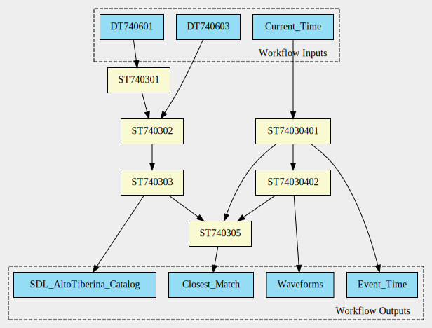
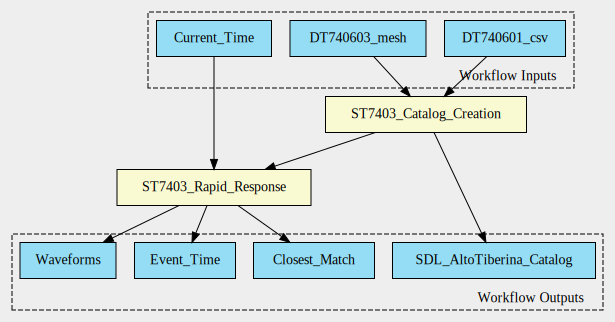
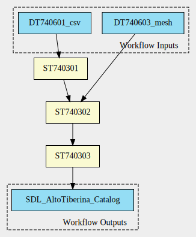
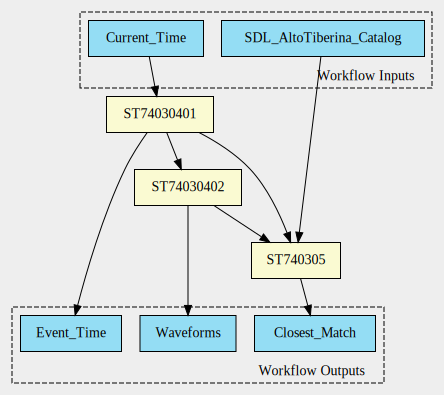

# WF7403 Workflow Files
This directory started with workflow files generated from the spreadsheet description of WF7403 using a [custom tool](https://github.com/Marco-Salvi/dt-geo-converter). 

## Workflow Adaptations
To transfer them into an executable CWL workflow, we first generated a workflow as close as possible to the spreadsheet descriptions (WF7403\_original.cwl). During the implementation phase of the workflow some smaller adjustments became necessary (e.g. to split input data or add additional output information). We also splitted ST740304 into two substeps: ST74030401 (detect event) and ST74030402 (download waveforms). This split could become obsolete if a "listener module" would take over the part and start ST74030402 whenever an event occurs. 

## High-level Workflow Schema
Since our workflow consists in fact of two workflows, we then generated a high-level version of the workflow (that consists of these two sub-workflows. At this point we simplified the names of inputs and outputs to increase readability.

## A. The Catalog Creation Workflow 
The Catalog Creation Workflow (WF7403a.cwl) requires about 0.5 million core hours on Tier-0 or Tier-1 HPC system. This workflow consists of several steps that will upload the catalog to the Simulation Data Lake (SDL)

## B. The Rapid Response Workflow 
The Rapid Response Workflow (WF7403b.cwl) regularly checks for earthquakes. If an earthquake is detected, it downloads waveforms and compares them to the catalog entries in the SDL.

## Executing the Rapid Response Workflow
Before the CWL version, the Rapid Response Workflow was implemented as a cronjob. To transform it into an executable .cwl workflow, we generated a Dockerfile that contains all necessary software and mounts the output directories as volumes. 
See (Docker/README.md) for more information. For testing at least the 10-entries version of the Catalog from the SDL [https://sdl.hpc.cineca.it/app/experiments/41/versions/1.0.0/summary] needs to be downloaded to the directory 'AltoTiberinaCatalog'. 
The 'Docker' directory also contains an adapted 'detect_event.py' function that will look for earthquakes with magnitude 2.0 and above within the last week. 'detect_event.py' is normally called every hour and looks for earthquakes with magnitude 4 and above. 
After running the workflow it will the directories 'TABOO_waveforms' and 'Scenario_Misfit' will contain the results. 

(Docker/WF7403b) contains an runnable version of this workflow. Comments show how it could be adapted to be run by a 'listener module'.

## File Overview

- **\*.svg Files**  
  Visual representations of the generated CWL files. Use [Graphviz](https://dreampuf.github.io/GraphvizOnline/) to render and review the workflow steps.

- **\*.cwl Files**  
  These files represent individual CWL workflows

- **Docker**
  This directory contains all the information necessary to execute the Rapid Response Workflow using .cwl. 

- **ro-crate-metadata.json**  
  A metadata template generated from the CWL description. It should list all the entities in the workflow. **Action:** Manually compile any missing details. If the CWL files are incorrect, update this file to reflect the changes. 

## Next Steps

We have carefully reviewed the issues and double-check the corresponding CWL files to ensure that all steps are correctly defined.

